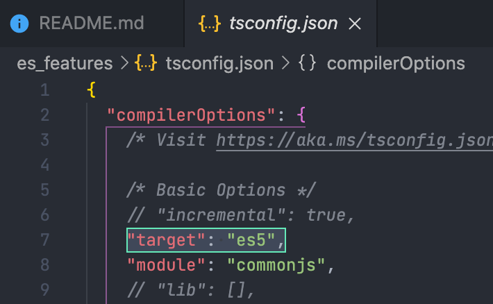

# ECMAScript 5

  
_[사진 출처](https://paperblock.tistory.com/67)_


## 🚀 Intro

`ES5`는 2009년도에 발표된 ECMAscript 5 의 줄임 표현으로,  
**IE9 🤪** 에서 `'use strict'`를 지원하지 않는 것을 제외하고는 대부분의 브라우저 버전에서 `ES5` 문법을 지원한다는 점이 특징입니다.

> _typescript_ 에서도 default target 이 `es5` 인 것을 볼 수 있습니다.



## 👀 ES5 주요 특징들

- [strict mode](#strict-mode)
- [String.trim()](###-string.trim)
- [Array.isArray()](###array.isarray)
- [Array.forEach()](###array.foreach)
- [Array.map()](###array.map)
- Array.filter()
- Array.reduce()
- Array.reduceRight()
- Array.every()
- Array.some()
- Array.indexOf()
- Array.lastIndexOf()
- JSON.parse()
- JSON.stringify()
- Date.now()

### strict mode

#### What is strict-mode


**사진출처 싸감아저씨**

말 그대로 엄격 모드입니다.  
반대 표현으로는 '느슨한 모드(sloppy mode)' 라고 부르기도 합니다.

기존의 느슨한 JS의 문법들을 엄격하게 검열한다고 생각하시면 될 것 같습니다.

1. 기존에는 **조용히** 무시되던 에러들을 _throwing_ 합니다.
2. _JavaScript_ 엔진의 최적화 작업을 어렵게 만드는 실수들을 바로 잡습니다.  
   가끔씩 **엄격모드**의 코드는 **비-엄격** 모드의 동일한 코드보다 더 빨리 작동하도록 만들어집니다.
3. 엄격 모드는 ECMAScript의 차기 버전들에서 정의 될 문법들을 금지합니다.

#### 엄격모드 적용하기

전체 스크립트를 엄격 모드로 적용하기 위해선  
script 최상단에 `'use strict';` 구문을 적어주면 됩니다.

```Javascript
'use strict';
// some code
```

함수에 엄격 모드를 적용하기 위해선  
함수 본문 처음에 `'use strict';`을 적어주면 됩니다.

```Javascript
function add(){
    'use strict';
    return "덧셈 안 해"
}
```

ES6 (ECMA2015)에 도입된 모듈에서는 엄격 모드 시작을 위한 구문 없이도  
자동으로 엄격모드입니다.

#### 조용한 에러들

> 엄격 모드와 비엄격 모드의 차이중 몇개를 뽑아서 정리했습니다.  
> 더 많은 특징들은 [MDN 공식 문서](https://developer.mozilla.org/ko/docs/Web/JavaScript/Reference/Strict_mode) 에서 확인하시기 바랍니다.

##### 1. 선언하지 않은 variable, object를 사용/수정/삭제 할 수 없다

느슨한 모드

```JavaScript
// "use strict";

이거_선언_되는_거였어 = 10;
console.log(이거_선언_되는_거였어);
```

엄격 모드

```JavaScript
"use strict";

이거_선언_되는_거였어 = 10; // error
console.log(이거_선언_되는_거였어);
```

##### 2. `with` statement

엄격 모드에서는 `with` 를 사용하지 못하게 합니다.  
런타임중에 블록 안의 모든 이름이 전달된 객체의 프로퍼티나 (또는 전역) 스코프 내의 변수로 매핑 될 수 있다는 것입니다.

느슨한 모드

```JavaScript
function cos(number) {
    console.log(number);
}

with (Math) {
    x = cos(2 * PI);
}
console.log(x); // 1
```

엄격 모드

```JavaScript
"use strict";

function cos(number) {
    console.log(number);
}

// error
with (Math) {
    x = cos(2 * PI);
}
console.log(x);
```

### string.trim()

양 끝에서 공백을 제거한 새로운 문자열을 반환합니다.  
인자로 받을 수 있는 것은 없습니다.

> 파이썬의 `strip()` 에게 공백을 인자로 준 것과 같은 역할입니다.

```Javascript

var a = " 누가 이렇게 저장을 해 "

console.log(a.trim()) // "누가 이렇게 저장을 해"
console.log(a) // " 누가 이렇게 저장을 해 "
```

### Array.isArray()

이 메서드는 전달받은 인자가 Array인지 판별합니다.

```Javascript
// Array.isArray(obj: Object): boolean

var a = Array;
var _a = Object;
var newArray = new Array();
var proto = Array.prototype;
var b = [];
var c = {};

console.log(Array.isArray(a)); // false
console.log(Array.isArray(_a)); // true
console.log(Array.isArray(newArray)); // true
console.log(Array.isArray(proto)); // true
console.log(Array.isArray(b));  // false
console.log(Array.isArray(c)); // false
```

### Array.forEach()

```TypeScript
Array.prototype.forEach(
    callbackfn: (
        value: any,
        index: number,
        array: any[]
    ) => void, thisArg?: any): void
```

`forEach`를 사용할때는 `for문`을 길게 늘여서 쓰기 싫어서 사용하는 경우가 많은데,  
모를법한 다른 기능들도 있으니 소개하고 가겠습니다. ~~제가 몰랐던겁니다~~

#### 1. thisArg

callback 을 실행할 때 `this`로 사용할 값입니다.

```JavaScript
function Counter() {
    this.sum = 0;
    this.count = 0;
}

Counter.prototype.add = function (array) {
    array.forEach(function (entry) {
        this.sum += entry;
        ++this.count;
        console.log(this) // Counter 객체
    }, this);
    // thisarg 가 빠지게 된다면 this는 Counter를 바라보지 않습니다.
};

const obj = new Counter();
obj.add([2, 5, 9]);
console.log(obj.count); // 3
console.log(obj.sum); // 16
```

#### 2. forEach 빠져 나오기

`forEach`는 `break` 가 지원되지 않습니다. (대체 왜...)  
하지만 약간의 편법을 더해주면 break 처럼 사용할 수 있습니다.

##### 1. try-catch

```JavaScript
var myArr = [1, 2, 3];
var count = 0;
var Break = new Error("Break");

try {
    myArr.forEach(element => {
        if (element == 2) throw Break;
        count++;
    });
} catch (err) {
    if (err != Break) throw Break; // 이 코드는 없어도 됩니다.
}

console.log(count); // 1

```

##### 2. every, some 에 if-else 문 사용하기

이건 사용 가능한 방법이긴 하지만,  
`every`와 `some`의 사용 취지와 맞지 않는 것 같아 저는 크게 와닿진 않았습니다.

### Array.map()

## 참고 문서 및 블로그

ES5 참고 블로그: <https://k39335.tistory.com/81>  
ES5 참고 문서: <https://developer.mozilla.org/ko/docs/Web/JavaScript/Reference>  
forEach Break 참고: <https://stackoverflow.com/questions/6260756/how-to-stop-javascript-foreach>
