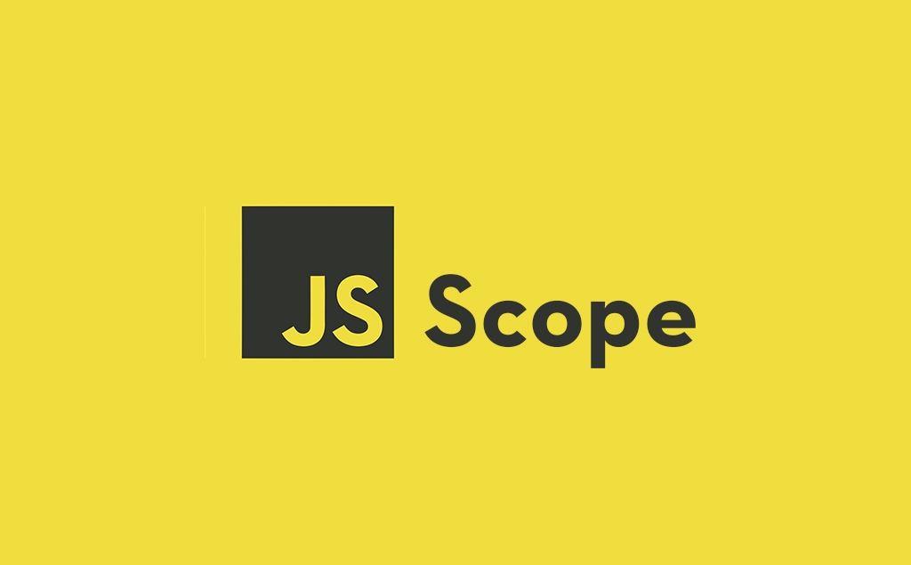

<h1 align="center">스코프 Scope</h1>

<p align="center">
    
</p>

# Index

- [정의](#mdn-says)
- [전역변수와 지역변수](#전역변수와-지역변수)
- [스코프 체인](#스코프-체인)
- [정적 스코프, Lexical Scoping](#정적-스코프)
- [NameSpace 만들기](#namespace-만들기)

## MDN Says

현재 실행되는 컨텍스트를 말한다. 여기서 컨텍스트는 값과 표현식이 "표현" 되거나 참조될 수 있음을 의미한다.  
만약 변수 또는 다른 표현식이 "해당 스코프" 내에 있지 않다면 사용할 수 없다.
스코프 또한 계층적인 구조를 가지기 때문에 하위 스코프는 상위 스코프에 접근 할 수 있지만 반대는 불가하다.

## 전역변수와 지역변수

전역 변수란 JavaScript에서 제일 바깥 범위(함수에 포함되지 않은)에 만들어진 변수를 말합니다.  
JS에서 최상위 객체는 window이므로 window에 저장되는 거라고 생가하시면 됩니다.(브라우저 기준)

```JavaScript
var x = 'Global';

function changeX(){
    var x = 'local'; // 지역변수 선언
    x = 'Changed local Value' // 지역변수 참조
}

changeX();
console.log(x); // 글로벌 변수 참조

```

위의 예에서 changeX 함수 내부의 x는 지역변수를 우선해서 찾기때문에  
지역변수를 수정하고 전역변수는 수정되지 않았습니다.

그 다음 console.log(x) 에서는 참조할 지역변수가 곧 전역변수 x ='Global' 이기 때문에 전역변수를 참조하게 되는 것입니다.

따라서 x를 어느 곳에서 호출했는지에 따라 x라는 변수가 지역변수가 될 수도 있고 전역변수가 될 수도 있게 되는 것입니다.

## 스코프 체인

내부 함수에서는 외부 함수의 변수에 접근이 가능하지만,  
외부 함수는 내부 함수의 변수에 접근할 수 없습니다.

따라서 내부 함수가 자신이 갖고 있지 않은 변수가 호출되었다면  
자신의 지역에서 먼저 찾고(지역변수), 없다면 한 단계 위로 올라가 찾고를 반복하면서 변수의 값을 참조하게 됩니다.

> 그러므로 모든 함수는 전역 변수를 참조할 수 있게되는 것입니다.

이렇게 꼬리를 물고 계속 범위를 넓히면서 찾는 관계를 `스코프 체인`이라고 합니다.

## 정적 스코프

> 동적 스코프(Dynamic Scope)  
> 함수를 어디서 `호출`하였는지에 따라 상위 스코프를 결정하는 것

정적 스코프의 언어는 함수를 어디서 `선언`하였는지에 따라 상위 스코프를 결정하는 언어입니다.

JS는 정적 스코프의 언어이기때문에 스코프가 함수를 호출할 때가 아닌,  
`선언`할 때 생기게 됩니다.

```JavaScript
var origin_name = 'minsoo';
function log(){
    console.log(origin_name); // 이 함수가 선언됨과 동시에 이 변수는 이미 minsoo
}

function wrapper(){
    var origin_name = 'new minsoo';
    log();
}

wrapper();
```

만약 호출이 되면서 스코프 체이닝이 이루어진다면  
(1) log 함수 내 `origin_name` 선언이 없으므로 한단계 위로 올라갑니다.  
(2) wrapper 함수에 `origin_name` 선언이 있으므로 'new minsoo' 라는 값을 참조해서 내려가게 됩니다.

하지만 JS는 선언을 하면서 스코프가 형성이 되는 정적 스코프의 언어이므로  
(1) log() 선언 -> `origin_name` 의 선언을 찾아볼 수 없으므로 한 단계위로 올라갑니다.  
(2) log() 함수의 한단계 위는 전역 객체이므로 'minsoo' 라는 값을 참조해서 내려오게 됩니다.

> 이러한 이유에서 전역변수는 사용을 지양해야합니다.  
> 변수명이 같아 의도하지 않은 전역변수가 참조될 수도 있기 때문입니다.

위와 같은 이슈를 해결하기 위한 방법중 하나가 객체안의 속성으로 선언해서 사용하는 방법이 있습니다.

```JavaScript
var obj = {
    x: 'local',
    y: function(){
        // some Code
    }
}
```

위처럼 선언하게 되면 x라는 변수명이 겹치게 되더라도 x 를 바로 참조하는 것이 아닌 obj.x 로 참조하기 때문에 혼선이 없습니다.  
위와 같은 방법을 **네임스페이스**를 만든다고 표현합니다.  
C++에서 `using namespace std;` 라고 썼던 것 기억하시나요? ~~혼잣말입니다.~~

## NameSpace 만들기

```JavaScript
var newScope = function () {
    var x = 10;
    var y = function () {
        console.log(x);
    };
    return { y: y };
};

var $$ = newScope();

$$.y(); // 10

```

위와 같이 저만의 `$$` 네임 스페이스를 만들어 봤습니다!  
이렇게 함수 선언을 통해 return 해주고 싶은 값만 결정해서 return 해주면 x 와 같은 변수들은 private한 값들로써 비공개 되는 겁니다.

## 참고 문헌

[zeroCho님 블로그](https://www.zerocho.com/category/Javascript/post/5740531574288ebc5f2ba97e)  
[빵속에꼼팡이님 블로그](https://soungnote.tistory.com/18)  
[poiemaweb.com](https://poiemaweb.com/js-execution-context)
